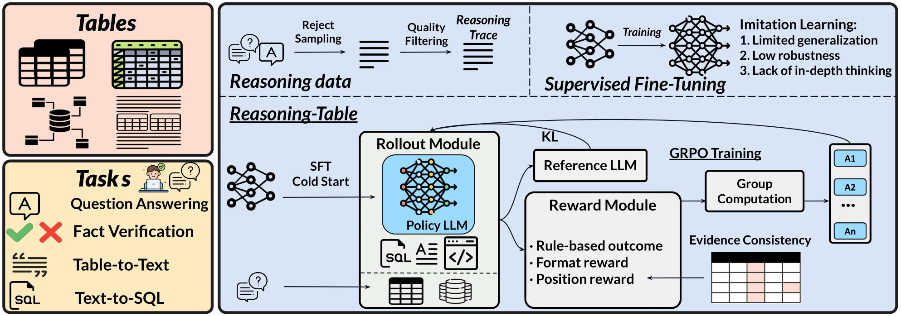

# Reasoning-Table: Exploring Reinforcement Learning for Table Reasoning

<!-- <p align="center">
  <a href=""> 🏠 Homepage</a> |
  <a href=""> 📜 Paper</a> | 
  <a href=""> 🤗 Dataset</a> | 
  <a href="#Installation"> 🚀 Installation</a> 
</p> -->

## Description
We introduce Reasoning-Table, the first application of reinforcement learning (RL) to table reasoning, achieving state-of-the-art performance. 
Through rigorous data preprocessing, reward design, and tailored training strategies, our method leverages simple rule-based outcome rewards to outperform SFT across multiple benchmarks. We also propose table-specific reward mechanisms to better leverage the table structure, particularly a position evidence consistency reward that addresses the reward sparsity inherent in RL paradigms applied to structured data interactions.
Unified training across diverse tasks enables Reasoning-Table to emerge as a robust table reasoning large language model, surpassing larger proprietary models like Claude-3.7 by 4.0\% on benchmark evaluations. 
Further experiments demonstrate that Reasoning-Table enhances the model's generalization capabilities.




## 🔥 News


## 🔍 Installation
Please install torch, vllm and ray according to your own environment configuration. We provide a configuration example adapted from TinyZero in the following:
```
pip install -r requirements.txt
```

```
# install torch
pip install torch==2.4.0 --index-url https://download.pytorch.org/whl/cu121
# install vllm
pip install vllm==0.6.3
pip install ray
```

Please further install the verl in the current project and flash attention.
```
# verl
pip install -e .

# flash attention 2
pip install flash-attn --no-build-isolation
# quality of life
pip install wandb IPython matplotlib
```

## 📊 Dataset


## 🧪 Training
For GRPO and PPO training, we provide configuration scripts for different model sizes. You can select the appropriate script based on your hardware resources:

```bash
# For Qwen2.5-3B-Instruct model training
bash train_grpo_3b.sh

# For Qwen2.5-7B-Instruct model training (requires more GPU memory)
bash train_grpo_7b.sh
```

Key parameters you may want to customize:
- `BASE_MODEL`: Path to the base model (e.g., `"/Qwen/Qwen2.5-3B-Instruct"`)
- `DATA_DIR`: Path to your training dataset (e.g., `data/wikitq`)
- `EXPERIMENT_NAME`: Name for your training experiment (used for logging and checkpoints)
- `trainer.n_gpus_per_node`: Number of GPUs to use per node (adjust based on hardware)
- `trainer.total_epochs`: Number of training epochs

The training scripts use [veRL](https://github.com/volcengine/verl) and support both GRPO (Generalized Return Policy Optimization) and standard PPO algorithms for reinforcement learning.

## 🔍 Evaluation
We provide a comprehensive evaluation script that supports multiple evaluation modes for table reasoning tasks. The evaluation pipeline uses both exact match metrics and LLM-based evaluation for more robust assessment.

To evaluate a trained model on a specific benchmark:

```bash
bash evaluation/test.sh
```

The `test.sh` script supports the following features:

- **Multiple Tasks**: Configurable for various benchmarks like WikiTableQuestions (`wikitq`), ToTTo (`totto`), and others via the `TASK_NAME` parameter.
- **Evaluation Modes**:
  - `standard`: Exact match evaluation (default)
  - `llm`: Uses LLM judge to evaluate responses (helpful for more complex reasoning tasks)
  - `combined`: Uses both exact match and LLM-based evaluation

- **Model Configuration**:
  - `MODEL_PATH`: Path to your fine-tuned model for inference
  - `EVAL_MODEL_PATH`: Path to evaluation model (when using LLM-based evaluation)
  - `MODEL_SIZE`: Size of your model (e.g., `3b`, `7b`)
  - `TRAIN_TYPE`: Training method (e.g., `grpo`, `ppo`, `sft`, `base`)

- **Hardware Configuration**:
  - `TENSOR_PARALLEL_SIZE`: Set based on your GPU configuration
  - `BATCH_SIZE`: Adjust based on available memory
  - `LLM_EVAL_BATCH_SIZE`: Batch size for LLM-based evaluation


## Acknowledge
Our code is built upon [veRL](https://github.com/volcengine/verl) and [TinyZero](https://github.com/Jiayi-Pan/TinyZero).

## 🖊️ Citation

